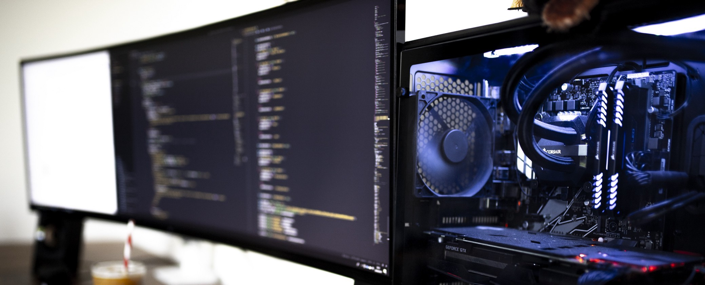

# ML_GPU
### This project containts personal practice ML code, and Deep Learning on GPUs.

<i>Photo by Caspar Camille Rubin on Unsplash. </i>
 <i><Milkshake is optional for the GPU set-up.</i>

### At the moment, I am learning, and following examples, from <a href=https://www.oreilly.com/library/view/hands-on-machine-learning/9781492032632/ target="_blank">Aurelien Geron's "Hands-On Machine Learning" book</a>

### I wrote a practical guide on setting a personal GPU server for Machine Learning with Ubuntu 20.04 <a href=https://towardsdatascience.com/set-up-of-a-personal-gpu-server-for-machine-learning-with-ubuntu-20-04-100e787105ad target="_blank"> avaialbe on the Towards Data Science (TDS) website</a>
